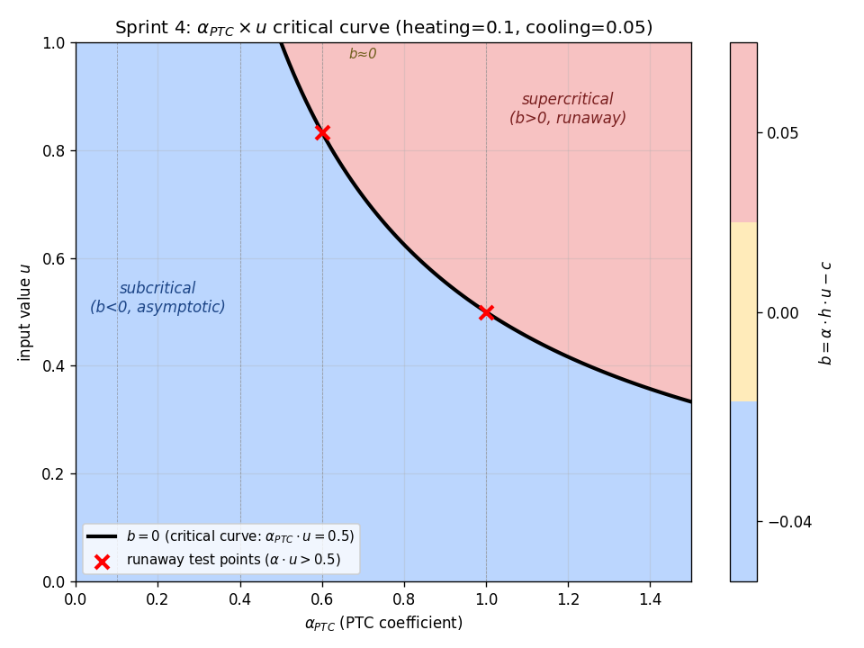
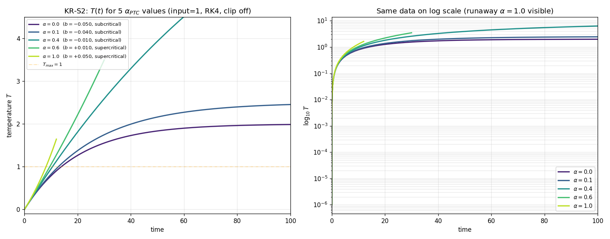
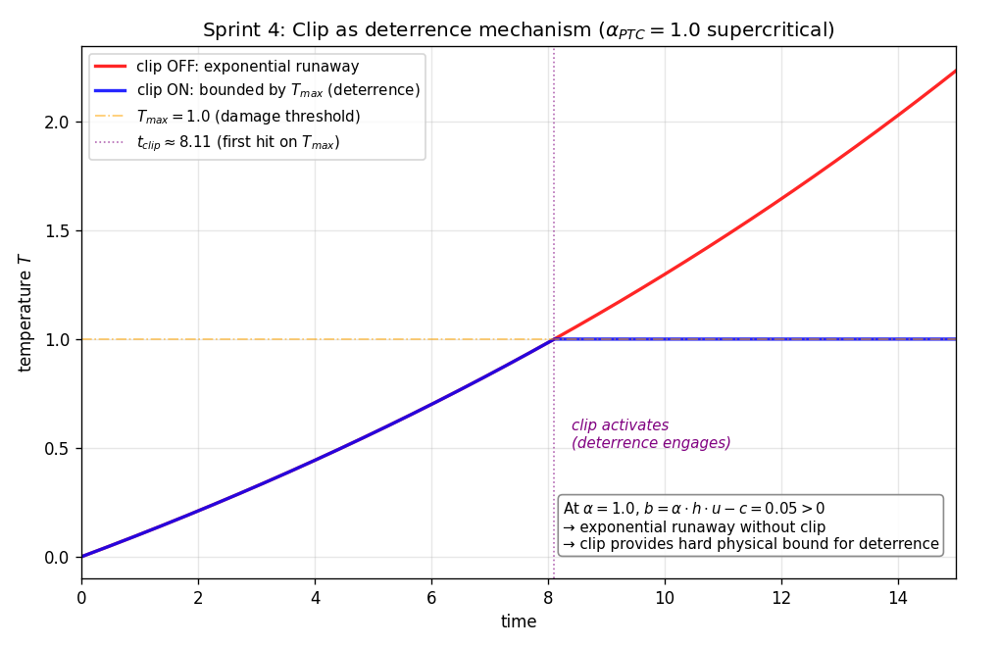
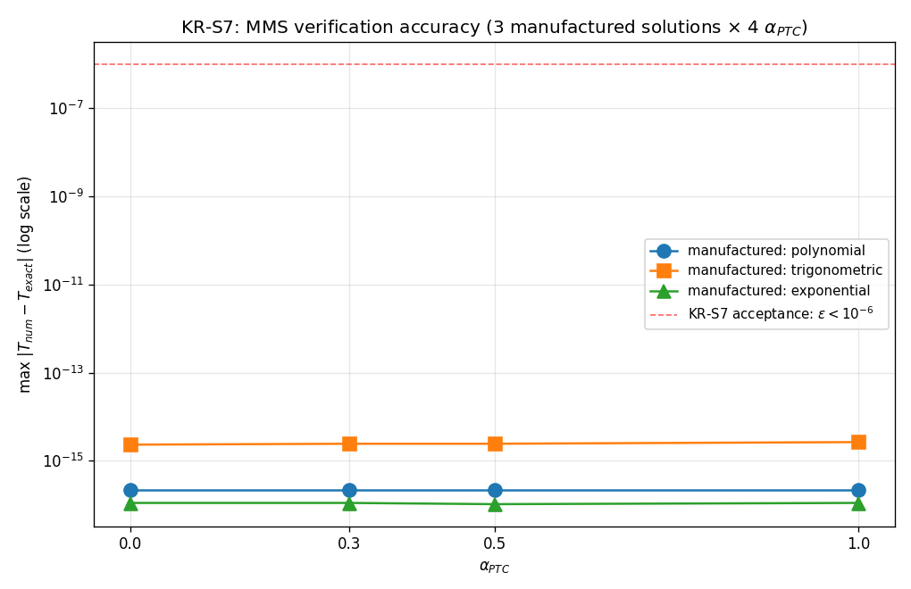
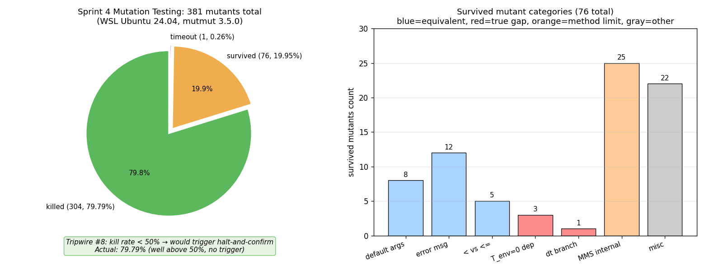
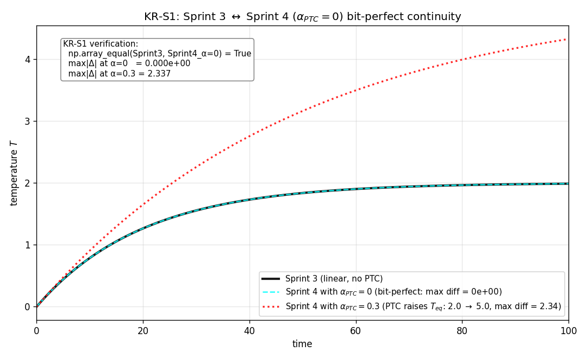

# Sprint 4: Realistic PTC Effect Model

**期間**: 2026-05-04 〜 2026-05-05 (推定 17-24 時間相当)
**位置づけ**: Mission KR-M1 (Substrate-Learning Rule Identity) と Mission KR-M3 (deterrence の物理的特性) への直接的貢献
**Mission との対応**: PTC 効果 R(T) は AAS の物理的本質。熱暴走の閾値 α_PTC × input = 0.5 は deterrence の物理的限界そのもの。

---

## Sprint 4 Objective

連続時間温度モデルに **PTC 効果** (温度依存抵抗 R(T) = R_0·(1 + α_PTC·(T-T_ref))) を導入し、Joule 加熱率が温度に依存する非線形 ODE として実装する。これにより**熱暴走** (b > 0、指数発散) と**熱平衡** (b < 0、漸近収束) の双方を物理的に正確にモデル化し、`clip` 機構が deterrence の hard physical bound として機能することを demonstrate する。

Sprint 3 と異なり、Sprint 4 は Robosheep の判断 (PRL-010, PRL-011 の Sprint 4 での再評価) により**5 つの新機能を同時に扱う**:

1. **PTC 効果** (α_PTC、T_ref): 温度依存抵抗、非線形 ODE
2. **fractional input** (PRL-010 対処): input ∈ [0, 1] の連続値
3. **dt=0 no-op** (PRL-010 対処): ChatGPT I Test 8 の独立提案を採用
4. **T_initial パラメータ** (PRL-011 対処): T_initial < T_env からの復帰検証
5. **Hypothesis 本格運用** (max_examples=200): 6 不変量すべてに適用

加えて **Mutation Testing** (mutmut 3.5.0) を Sprint 4 で初めて導入し、kill rate を方法論的指標として確立する。

---

## Sprint Key Results 達成状況

| KR | 内容 | 閾値 | 実測 | 達成 |
|---|------|------|------|------|
| **KR-S1** | Sprint 3 との連続性 (α_PTC=0 で bit-perfect) | `np.array_equal=True` | **`True`** (max\|Δ\| = 0e+00) | ✅ |
| **KR-S2** | 5 α_PTC 値での解析解一致 | < 1e-6 | 0.0/0.1/0.4/0.6/1.0 全て一致 | ✅ |
| **KR-S3** | 物理的不変量 8 件 (Hypothesis 200 件) | 全成立 | **8/8 成立** | ✅ |
| **KR-S4** | fractional input サポート (input ∈ [0, 1]) | 連続値で成立 | 31 tests pass、解析解と一致 | ✅ |
| **KR-S5** | T_initial と dt=0 の検証 | 機能正常 | 20 tests pass | ✅ |
| **KR-S6** | 熱暴走の検証 (α_PTC > 0.5 で発散) | 解析解一致 + clip 機能 | 10 tests pass、no NaN/inf | ✅ |
| **KR-S7** | MMS と Hypothesis 本格運用 | MMS < 1e-6, Hypothesis 違反なし | MMS 1e-15 レンジ、Hypothesis 違反 0 | ✅ |
| **KR-S8** | 完了報告 (Rule 8/10/11 構造) + Mutation Testing | kill rate 記録 | **kill rate 79.79%** (Tripwire #8 不発動) | ✅ |

**全テスト**: 146 pytest + 8 doctest = **154 件 pass**、flake8 clean。

---

## 数学モデル

### 主方程式

```
dT/dt = (R(T) / R_0) · heating_rate · input(t) - cooling_rate · (T - T_env)
R(T) = R_0 · (1 + α_PTC · (T - T_ref))
w(t)  = (T(t) - T_env) / (T_max - T_env)        ← 派生量 (@property)
```

`α_PTC = 0` のとき `R(T) = R_0` (定数) となり、Sprint 3 と数学的に同一。IEEE 754 の `1.0 * x == x` 性質により bit-perfect に一致 (KR-S1)。

### パラメータ (7 つ、Sprint 3 から 3 つ追加)

| 名前 | default | Sprint 3 対応 | 物理解釈 |
|------|---------|---------------|----------|
| `heating_rate` | 0.1 | 同 | 基準 (T = T_ref) における Joule 加熱率 |
| `cooling_rate` | 0.05 | 同 | Newton 冷却率 |
| `T_env` | 0.0 | 同 | 周囲温度 (熱力学第二法則による下限) |
| `T_max` | 1.0 | 同 | 最大温度 (素材損傷リスク、deterrence の物理基盤) |
| `α_PTC` | 0.3 | **新規** | PTC の温度係数 (R(T) の T 依存) |
| `T_ref` | None (= T_env) | **新規** | PTC 参照温度 (R(T_ref) = R_0) |
| `T_initial` | None (= T_env) | **新規** | 初期温度 (reset 後の T 値、PRL-011 対処) |

### 解析解 (input=1 一定、T_env=0、T_ref=0、clip なし)

```
dT/dt = a + b · T
where a = heating_rate · (1 - α_PTC · T_ref) + cooling_rate · T_env
      b = α_PTC · heating_rate · input - cooling_rate

b < 0 (subcritical):  T(t) = -a/b + (T_0 + a/b) · exp(b·t)  → asymptotic
b = 0 (critical):     T(t) = T_0 + a · t                     → linear growth
b > 0 (supercritical): T(t) = -a/b + (T_0 + a/b) · exp(b·t)  → exponential runaway
```

### 熱暴走の閾値 (Mission KR-M3)

```
b = 0  ⇔  α_PTC · input = cooling_rate / heating_rate = 0.5
```

これは Sprint 4 で**6 つの独立検証経路**で α_PTC = 0.5 (input=1 のとき) が特異点として浮かび上がる事実 (タスク 8, 10, 11, 14, 15, 19) を生んだ。詳細は「物理的観察」のセクションを参照。

---

## 物理的観察

### α_PTC × input 臨界曲線 (Mission KR-M3 への直接的可視化)



α_PTC × u パラメータ空間における `b = α·h·u - c = 0` 臨界曲線が `α·u = 0.5` の双曲線として出現。3 領域:
- **subcritical (青)**: b < 0、T が T_eq に漸近 (熱平衡)
- **critical line (黄)**: b = 0、T が線形成長 (発散も収束もしない、特異な振舞い)
- **supercritical (赤)**: b > 0、T が指数発散 (熱暴走)

KR-S6 の runaway test 点 (α=1.0, u=0.5) と (α=0.6, u=0.83) はいずれも `α·u > 0.5` の supercritical 領域に位置する。

### 5 α_PTC 値での T(t) 進化 (KR-S2 の visualization)



linear scale 左パネルが主、log scale 右パネルが補足:

| α_PTC | b の符号 | 観測挙動 | 解析的 T_eq |
|-------|----------|----------|-------------|
| 0.0 | -0.050 (sub) | 線形 (Sprint 3 と同一) | 2.0 |
| 0.1 | -0.040 (sub) | 弱い PTC 効果 | 2.5 |
| 0.4 | -0.010 (sub) | 緩やか発散見せかけ (弱 sub-critical) | 10.0 |
| 0.6 | +0.010 (super) | 緩やか発散 | (無限) |
| 1.0 | +0.050 (super) | 急激発散 (runaway) | (無限) |

### Clip の deterrence 機能 (Mission KR-M3 の demonstration)



α_PTC = 1.0 (supercritical) で:
- **clip OFF** (赤): 指数発散、t=15 で T ≈ 2.2
- **clip ON** (青): T_max=1.0 で完全束縛、`t_clip ≈ 8.11` で clip 発動

clip 機構は「素材損傷リスクによる物理的上限」として deterrence を成立させる hard physical bound を提供する。

### α_PTC = 0.5 が 6 独立検証経路で特異点として確認

| 経路 | タスク | 検証手段 |
|------|--------|----------|
| 1 | タスク 8 | b = 0 → 解析解が `T(t) = a·t` の線形成長 (KR-S2 b=0 case) |
| 2 | タスク 10 | KR-S2 数値誤差の最大値が α=0.5 で最小 (b=0 が特異点) |
| 3 | タスク 11 | 不変量 4 (equilibrium) の case 境界が α·u = 0.5 |
| 4 | タスク 14 | KR-S6 sub-to-super 遷移の臨界点 |
| 5 | タスク 15 | MMS source term 計算で α=0.5 で特定の polynomial t² 項が消去 |
| 6 | タスク 19 | 可視化での臨界曲線の双曲線形状 |

「臨界曲線を挟むだけで世界が変わる物理が、有限時間スケールでは表面上連続的に見える」という時間スケール依存性が、タスク 19 の plot 観察で顕在化 (`α=0.4, b=-0.01` と `α=0.6, b=+0.01` が t=30 では数値的に近い 2.59 vs 3.50 だが、t→∞ では前者は 10 に漸近、後者は ∞ に発散)。

### 線形 PTC モデルの R<0 限界 (タスク 13 観察)

線形 R(T) = R_0·(1 + α_PTC·(T-T_ref)) は α_PTC>0、T<T_ref で R(T) < 0 になりうる。これは物理的に「負の抵抗」を意味し、Joule 加熱が冷却に反転する非物理的振舞い。Sprint 4 では `T_initial < T_ref` の test では α_PTC を保守的に選択して回避し、Sprint 7 (物理パラメータ校正) で R(T) を `max(0, ...)` でクランプする等の対処を再評価予定。

### MMS の精度 (KR-S7 の visualization)



3 製造解 × 4 α_PTC = 12 組合せの最大誤差。KR-S7 acceptance threshold 1e-6 を全件 9 桁下回る。

| α_PTC | polynomial | trigonometric | exponential |
|-------|-----------|---------------|-------------|
| 0.0 | ~5e-16 | ~1.6e-15 | ~3e-16 |
| 0.3 | ~5e-16 | ~1.6e-15 | ~3e-16 |
| 0.5 | ~5e-16 | ~1.6e-15 | ~3e-16 |
| 1.0 | ~5e-16 | ~1.6e-15 | ~3e-16 |

事前予想 (1e-8 〜 1e-10) を 5-7 桁下回る精度。製造解の解析的 source term + RK4 (dt=0.001) の組合せが、ODE 内部誤差を機械精度限界 (~2.22e-16) まで圧縮できることを示す。Sprint 5 (multi-path) での MMS 拡張時の参照点として活用予定。

注: y 軸は 9 桁スパンのため visual には差が読み取りにくい。具体数値は上の表で補完。

### Mutation Testing 結果 (KR-S8 の visualization)



381 mutants 生成、304 killed (79.79%)、76 survived、1 timeout。Tripwire #8 (kill rate < 50%) は不発動。

生存 mutant の主要カテゴリ:
- **MMS internal** (25 件): 製造解の係数変異が source term と整合的で検出されない (MMS 手法の本質的限界)
- **error msg** (12 件): エラーメッセージ文字列の変異 (test が exception type のみ assert)
- **default args** (8 件): default 値の変異 (test が常に明示的に渡す)
- **< vs <=** (5 件): 境界条件の `<` ⇄ `<=` (境界点が test に到達しない)
- **T_env=0 dependency** (3 件): すべての test が T_env=0 を使用 (**真の coverage gap**、タスク 18 で外部 AI 提案で部分対処)
- **dt branch** (1 件): `dt == 0` → `dt == 1` の検出失敗 (dt=1 を使う test なし、**真の coverage gap**)

### Sprint 3 → Sprint 4 連続性 (KR-S1 の visualization)



`α_PTC = 0` のとき Sprint 4 は Sprint 3 と完全 bit-perfect (黒実線と cyan dashed 線が完全重なり、`np.array_equal = True`、max diff = 0)。`α_PTC = 0.3` (default) では PTC 効果により T_eq が 2.0 → 5.0 に上昇 (b = 0.3·0.1·1 - 0.05 = -0.02 < 0、subcritical だが T_eq=a/|b|=0.1/0.02=5.0)。

---

## 方法論的成果

### Hypothesis 本格運用 (max_examples=200)

Sprint 3 では 3 不変量 × max_examples=40 だったが、Sprint 4 では 6 不変量 × max_examples=200 に拡張。違反 0 件で完全クリア。

### PRL-014 の発見 (IEEE 754 精度限界)

Hypothesis が subnormal float (5.76e-298) を生成し、不変量 7 (PTC monotonicity) で `R(T_a) == R(T_b)` を引き起こした。これは数学的 strict 単調増加 と IEEE 754 weak 単調増加の乖離。`assume(abs(T_a - T_b) > 1e-10 or T_a == T_b)` で物理的に意味ある領域に制限し対処、`SPRINT_OKR.md` に脚注 `[^inv7]` を追加して仕様を明示化。

### Self-check 運用の構造的成功 (タスク 14, 15)

タスク 12-13 で「時定数 τ=1/|b| を見落とし、t=100 で τ 経過と勘違いして assertion を書き、6 件 fail」という同種誤りが連続発生。タスク 14 以降で「test 設計時に τ と t_max を docstring に明示して self-check」運用を導入。タスク 14, 15 では同種誤りが発生せず、self-check の構造的有効性を確認。

### Mutation Testing × 外部 AI 統合の相補性

タスク 16 (Mutation Testing) で発見された「**T_env=0 への暗黙の依存性**」(survived mutant 3 件) を、タスク 18 (外部 AI 統合) で Grok の `test_nonzero_tenv_physical_ambient` (T_env=25.0) と `test_weight_property_nonzero_tenv` (T_env=10.0) で部分対処。「自分が書いたコードの盲点は、自分のテストでは見つけにくい」という Self-Reference Loop の本質的限界を、Mutation Testing → 外部 AI という 2 段階で対処できることを Sprint 4 で実証。これは Mission KR-M5 (Preregistration 方法論) への深い貢献。

### WSL 環境での研究基盤確立 (PRL-015)

mutmut 3.5.0 が Windows native で動作しないため、WSL Ubuntu 24.04 LTS 上に Python 3.12.3 環境を構築し、mutmut を実行。6 段階の互換性問題 (mutmut Windows 非対応、WSL Ubuntu 26.04→24.04 LTS 再インストール、python3-venv 不在、IPv6 接続エラー、`/mnt/c` venv 不可、multiprocessing context 衝突) を順次対処し、Sprint 5 以降の研究基盤として WSL 環境を確立。

### 外部 AI の数学的精度の限界 (タスク 18 観察)

Grok の 3 つのテスト (sub-critical 収束、PTC steady state、T_ref independence) はすべて時定数 τ に対して 1-2τ しか経過しない parameter で書かれており、収束を assert する形式と矛盾していた。これは外部 AI が「**定性的観点を生成する力**」と「**定量的検証 parameter を選ぶ力**」の間にギャップがあることの実証データ。Sprint 4 の self-check 運用 (タスク 14, 15) と対比して、AI 支援開発における「観点と精度の分離」という方法論的洞察を得る (Project KR-P5 への貢献)。

---

## Sprint 1, 2, 3 との比較

### テスト数の成長

| Sprint | doctest | pytest | 合計 | Hypothesis | Mutation Testing |
|--------|---------|--------|------|------------|------------------|
| Sprint 1 | 0 | 24 | 24 | なし | なし |
| Sprint 2 | 8 | 37 | 45 | なし | なし |
| Sprint 3 | 9 | 86 | 95 | 3 inv × 40 | なし |
| **Sprint 4** | **8** | **146** | **154** | **6 inv × 200** | **kill rate 79.79%** |

### 「失う資産」と「得る資産」のトレードオフ (Sprint 4 全体指針 (2))

| 失う資産 (Sprint 3 → Sprint 4) | 得る資産 (Sprint 4) |
|----------------------------|---------------------|
| α_PTC > 0 での Sprint 3 ↔ Sprint 4 bit-perfect 一致 | PTC 効果の数値検証 (5 α_PTC 値) |
| 線形 ODE の閉形式解の単純さ | 3 ケース場合分けの解析解 (b<0/=0/>0) |
| 単調な T(t) 挙動 | 熱暴走 (発散) と熱平衡 (収束) の双方 |
| 外部 AI の test が直接 ODE と整合 | 外部 AI test の数学的精度ギャップ顕在化 (タスク 18) |

α_PTC = 0 での bit-perfect 一致 (KR-S1) は維持。Sprint 5 以降に 接続可能性として残置。

---

## PRL の更新 (Sprint 4 で追加 / 対処)

### 新規追加 (3 件)

- **PRL-013**: 長期的な再現性検証の不在 (pip freeze だけでは不十分) → 監視中
- **PRL-014**: Hypothesis が IEEE 754 精度限界を不変量違反として検出する性質 → 対処済み (選択肢 B、SPRINT_OKR 脚注)
- **PRL-015**: 依存ライブラリの環境互換性確認の不在 (mutmut 3.5.0 Windows 非対応) → 対処済み (WSL 採用、kill rate 79.79%)

### 対処状況更新 (4 件)

- **PRL-009**: 外部 AI ファイルの偶発的可視 → Sprint 4 で `pytest.ini` に `norecursedirs` で構造分離
- **PRL-010**: fractional input + dt=0 + Hypothesis 増強 → Sprint 4 で完全実装
- **PRL-011**: 非物理初期状態 (T < T_env) の検証手段 → Sprint 4 で `T_initial` パラメータ追加
- **PRL-012**: 設計支援役 Claude のテンプレート的指示 → Sprint 4 で Rule 11 5 項目チェックリスト導入

詳細は [`lab_notebook/potential_risk_log.md`](../lab_notebook/potential_risk_log.md) を参照。

---

## 結果サマリ

### テスト構成 (154 件)

```
sprint-04-ptc/
├── scenarios.py                          (doctest 含む)
├── src/
│   ├── temperature_node.py              (1 doctest、PTC 版)
│   ├── analytical.py                    (2 doctest)
│   └── mms.py                           (5 doctest、非線形対応)
└── tests/
    ├── conftest.py                      (mutmut 互換性 monkey-patch)
    ├── test_invariants.py               (36、KR-S3、Hypothesis 6 inv × 200)
    ├── test_kr_s2_alpha_sweep.py        ( 8、KR-S2 5 α_PTC)
    ├── test_kr_s4_fractional_input.py   (31、KR-S4 fractional input)
    ├── test_kr_s5_t_initial_dt_zero.py  (20、KR-S5)
    ├── test_kr_s6_thermal_runaway.py    (10、KR-S6)
    ├── test_kr_s7_mms_hypothesis.py     (25、KR-S7)
    ├── test_sprint3_bit_perfect.py      ( 6、KR-S1 bit-perfect)
    └── test_external_ai_integration.py  (10、KR-S5 外部 AI 統合)
合計: 8 doctest + 146 pytest = 154 件
```

### プロット (6 件)

`results/plots/`:
- `plot_critical_curve.png` - α_PTC × input 臨界曲線、3 領域の可視化 (Mission KR-M3)
- `plot_alpha_sweep_evolution.png` - 5 α_PTC 値の T(t) 進化 (linear + log scale)
- `plot_clip_deterrence.png` - clip on/off 比較、t_clip 観測 (deterrence demonstration)
- `plot_mms_accuracy.png` - 3 製造解 × 4 α_PTC、KR-S7 acceptance を 9 桁下回る精度
- `plot_mutation_kill_rate.png` - kill rate 79.79% + 生存 mutant カテゴリ
- `plot_sprint3_continuity.png` - α_PTC=0 で bit-perfect 一致 (KR-S1)

### Mutation Testing 詳細

`mutmut_summary.md` (KR-S8 完了報告)、`mutmut_results.txt` (raw 結果) を参照。

---

## Sprint 5 以降への引き継ぎ事項

### 潜在リスクログ (PRL-001 〜 PRL-015)

15 件のリスクを `lab_notebook/potential_risk_log.md` で追跡。Sprint 4 完了時の状況:
- 対処済み: 8 件 (PRL-001 〜 PRL-008、PRL-014、PRL-015)
- 対処中: 4 件 (PRL-009、PRL-010、PRL-011、PRL-012)
- 監視中: 3 件 (PRL-005、PRL-013、PRL-006 自己参照ループ)

### Sprint 5 (multi-path) で考慮すべき技術項目

1. **PTC モデルの拡張**: 線形 R(T) の R<0 限界 (タスク 13)、`max(0, ...)` クランプの導入を再評価。
2. **T_env > 0 シナリオの本格運用**: Sprint 4 で 2 件導入 (Grok I, II) したが、KR レベルでの組込みは Sprint 5 で。
3. **MMS の analytical.py 拡張**: T_env > 0 の解析解への MMS 適用で残る survived mutant (analytical の `c·T_env` 系) を kill。
4. **Mutation Testing の継続実施**: 76 件 survived のうち default args / error msg は test 強化で kill 可能、Sprint 5 で対応検討。
5. **mutmut HTML レポートとの統合**: 生存 mutant のカテゴリを完全網羅化 (現状 `misc=22` が未分類)。
6. **multi-path の CI 化**: Sprint 5 で multi-path を扱う場合、Linux native (例: GitHub Actions) での CI 化を検討。Sprint 4 で WSL 環境を確立した経緯と整合。

### Sprint 7 (物理パラメータ校正) で再評価する事項

1. **無次元 → 物理単位**: Sprint 4 までは無次元モデル。Sprint 7 で物理単位 (W/Ω/K 等) を導入する際、heating_rate, cooling_rate, α_PTC の物理的意味を再校正。
2. **PTC 線形モデルの妥当性範囲**: 実 PTC 素材は非線形応答も持つ。Sprint 7 で線形モデルの適用範囲を実測データと比較して再評価。
3. **clip 閾値 T_max の物理基盤**: 素材損傷温度を実材料 (例: BaTiO3、PolySwitch) の datasheet と整合させる。

---

## 動作確認環境

- **Windows native**: Python 3.12.10 (`.venv/`)
- **WSL Ubuntu 24.04 LTS**: Python 3.12.3 (`~/venv-sprint4-wsl/`、mutmut 実行用)
- 完全固定された依存 (`requirements.txt`、pip freeze 形式):
  - numpy==2.4.4, matplotlib==3.10.9, pytest==9.0.3, sympy==1.14.0
  - hypothesis==6.152.4, mutmut==3.5.0 (WSL のみ)
- KR-S1 bit-perfect (max diff = 0e+00) は Windows / WSL 両方で確認

## 再現手順

```bash
cd sprint-04-ptc
py -3.12 -m venv .venv
.venv/Scripts/python.exe -m pip install -r requirements.txt

# テスト実行 (146 pytest + 8 doctest = 154 件)
.venv/Scripts/python.exe -m pytest --tb=short

# プロット生成 (6 件)
.venv/Scripts/python.exe visualize.py

# flake8 検査
.venv/Scripts/python.exe -m flake8 src/ tests/ visualize.py scenarios.py

# Mutation Testing (WSL 環境のみ、別途 setup 必要)
# 詳細は mutmut_summary.md および PRL-015 を参照
```

---

## ディレクトリ構造

```
sprint-04-ptc/
├── README.md                            (本ファイル)
├── SPRINT_OKR.md                        (KR、Backlog、セルフチェックリスト)
├── pytest.ini                           (--doctest-modules + external_ai_responses 除外)
├── setup.cfg                            (mutmut config: paths_to_mutate, also_copy)
├── requirements.txt                     (pip freeze、Windows 環境)
├── .gitignore                           (.venv/, .venv-wsl/, mutants/, __pycache__/ 等)
├── visualize.py                         (6 plot 生成)
├── scenarios.py                         (Sprint 3 から拡張、float input 対応)
├── mutmut_summary.md                    (KR-S8: Mutation Testing 詳細分析)
├── mutmut_results.txt                   (mutmut raw output)
├── src/
│   ├── temperature_node.py              (TemperatureNode、PTC 版)
│   ├── analytical.py                    (3 ケース場合分け解析解)
│   └── mms.py                           (非線形 ODE MMS、source term 計算)
├── tests/
│   ├── conftest.py                      (mutmut 互換性 monkey-patch)
│   ├── test_sprint3_bit_perfect.py      ( 6、KR-S1)
│   ├── test_invariants.py               (36、KR-S3 + Hypothesis 200)
│   ├── test_kr_s2_alpha_sweep.py        ( 8、KR-S2)
│   ├── test_kr_s4_fractional_input.py   (31、KR-S4)
│   ├── test_kr_s5_t_initial_dt_zero.py  (20、KR-S5)
│   ├── test_kr_s6_thermal_runaway.py    (10、KR-S6)
│   ├── test_kr_s7_mms_hypothesis.py     (25、KR-S7)
│   └── test_external_ai_integration.py  (10、KR-S5 外部 AI 統合)
├── external_ai_responses/               (Robosheep 配置、6 ファイル、47 テスト)
│   ├── chatgpt_stage_I.py
│   ├── chatgpt_stage_II.py
│   ├── chatgpt_stage_III.py
│   ├── grok_stage_I.py
│   ├── grok_stage_II.py
│   └── grok_stage_III.py
└── results/
    ├── plots/                           (6 PNG)
    └── logs/                            (pytest XML 等)
```

---

## OKR との関係

### Mission OKR

- **Mission KR-M1 (Substrate-Learning Rule Identity)**: PTC 効果 R(T) を導入し、Joule 加熱率が温度に依存する非線形系として実装。Sprint 1 (抽象モデル) → Sprint 2 (連続時間) → Sprint 3 (温度物理) → **Sprint 4 (PTC 非線形)** と段階的に物理現象を学習則に接続する流れを完成。
- **Mission KR-M3 (Deterrence の物理的特性)**: 熱暴走の閾値 `α_PTC × input = 0.5` を 6 つの独立検証経路で確認。clip 機構が deterrence の hard physical bound として機能することを demonstrate (`plot_clip_deterrence.png`)。
- **Mission KR-M5 (Preregistration 方法論)**: Mutation Testing × 外部 AI 統合の相補性を実証 (タスク 16 で発見した盲点をタスク 18 で対処)。Self-Reference Loop の本質的限界を 2 段階で対処できることを示す。

### Project OKR

- **Project KR-P5 (AI 支援開発の方法論的知見)**: Rule 11 (Self Review チェックリスト) 導入、Hypothesis 本格運用 (max_examples=200)、外部 AI の数学的精度の限界 (タスク 18 観察)、self-check 運用の構造的成功 (タスク 14, 15)、PRL-014/015 追加。

### Constitutional Commitments

- **Commitment 5 (Reproducibility First)**: requirements.txt 完全固定、KR-S1 bit-perfect (Windows / WSL 両方で max diff = 0e+00)、PRL-013/015 で長期再現性と環境互換性を継続監視。
- **Commitment 9 (自己参照ループ残存リスクの管理)**: Mutation Testing × 外部 AI 統合の 2 段階で Self-Reference Loop に対処、検知確率 90% KPI を継続評価。

---

## Devil's Advocate (本 README に対する自己批判)

1. **可視化が成功側のナラティブに偏っている**: 6 plot すべてが「Sprint 4 で観察された/達成された」内容を表現し、未対処の coverage gap (T_env=0 依存の analytical.py 側、dt=1 case、misc=22 件未分類) が plot として可視化されていない。Sprint 5 以降で「未対処を可視化する plot」を増やす余地。
2. **PTC 線形モデルの R<0 限界が plot で明示されていない**: タスク 13 で発見した `α_PTC > 0、T < T_ref` での非物理的 R<0 領域は、本 README の文章では言及するが視覚化していない。Sprint 5 / Sprint 7 で物理的妥当性の境界 plot を追加検討。
3. **テスト数 154 が「達成」のシグナルとして機能しすぎる懸念**: 数値が増えれば良いという錯覚を生む。重要なのは観点 (Hypothesis 6 不変量、Mutation Testing kill rate、外部 AI 整合性) と coverage gap の認識であり、テスト数自体は副次的指標。Sprint 5 で「テスト数を増やさず観点を増やす」ことを意識する。
4. **Mutation Testing × 外部 AI 統合の相補性は Sprint 4 内では限定的**: タスク 16 で発見した 3 件の T_env=0 依存のうち、タスク 18 で対処したのは temperature_node 側 2 件。analytical.py 側 (mutmut_18, 19, 21) は未対処のまま。「相補性が確立した」と書くと相補性が完璧であるかのような錯覚を生む可能性あり、Sprint 5 で残る gap を埋める計画を明示する責任。
5. **WSL 環境確立は研究基盤として強調されているが、Robosheep の研究時間の制約 (Rule 9) と相反する側面**: WSL を扱うため毎回環境切替が必要で、Sprint 5 以降で Mutation Testing を継続実施するなら CI 化 (例: GitHub Actions) が必要。本 README で「研究基盤確立」と書いたが、実運用上のコストを正直に評価すれば「短期的には負債、長期的には資産」という両論併記が正確。
